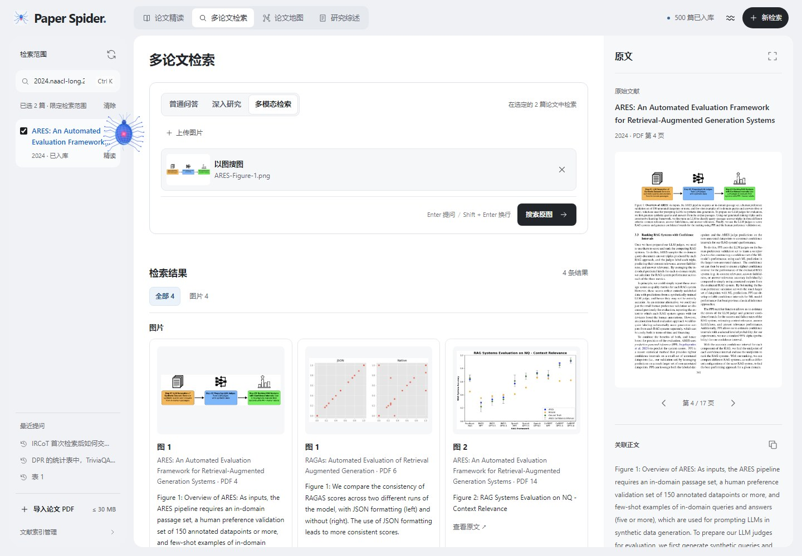
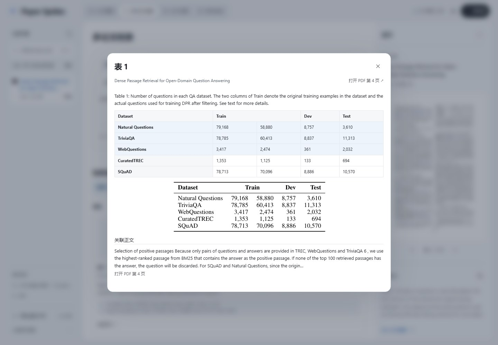
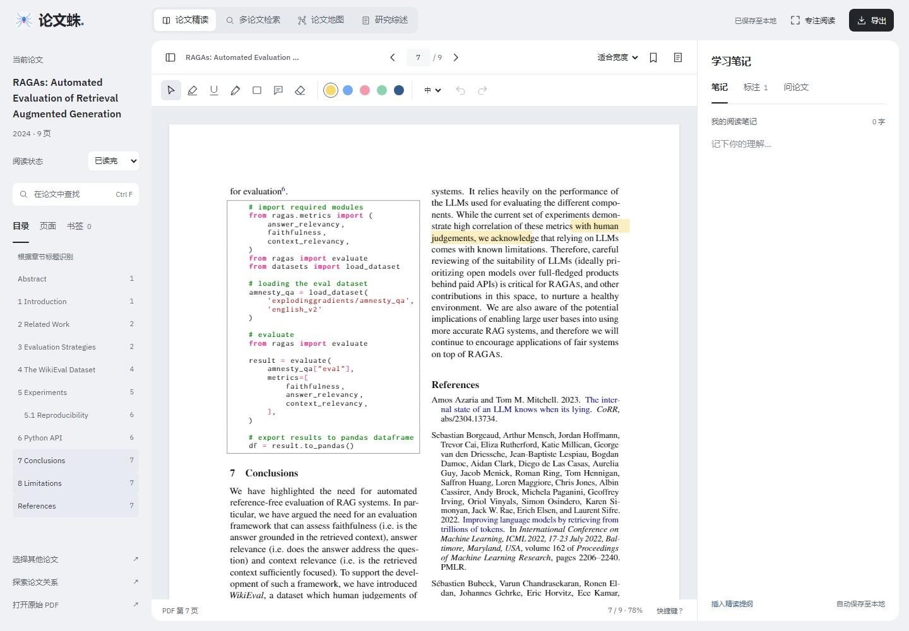
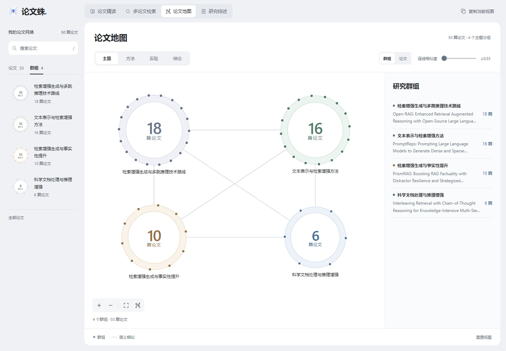
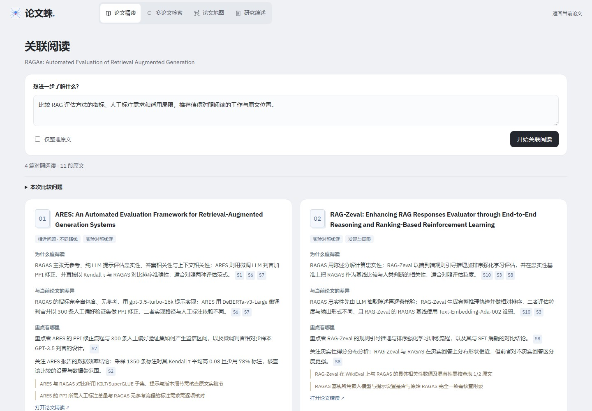

  

  <a href="#工作台">工作台</a> ·
  <a href="#多模态检索">多模态检索</a> ·
  <a href="#精读与研究">精读与研究</a> ·
  <a href="#评测结果">评测结果</a> ·
  <a href="#本地运行">本地运行</a>

  <strong>500</strong> 篇论文 · <strong>125,900</strong> 条检索记录 · <strong>3,336</strong> 张已索引图片 · <strong>200</strong> 篇已建图论文

## 工作台

在同一个工作台查找正文、图片和表格，并在右侧打开 PDF 来源页。

## 多模态检索

上传论文里的裁图，可找回原图和出处。打开表格命中，可并列核对高亮的匹配行、完整表头和原表。点击截图可查看大图。

  
  

Docling 保存原文段落、图表与 PDF 来源位置，超长段落使用重叠窗口。图表拥有独立对象 ID 与原页裁图，当前索引包含 **8,782 条正文与图表链接**。

| 对象 | 检索机制 | 返回的证据 |
| :--- | :--- | :--- |
| **正文** | 中文查询译成英文，BM25 与 BGE-M3 双路召回，RRF 融合及 Cross-Encoder 重排 | 原文、章节与 PDF 页码 |
| **图片** | 融合图注、图内文字、正文引用或邻近段落，以及 CLIP 视觉向量 | 原图裁片、图注、关联段落 |
| **表格** | 整表检索定位表题和列名，行级检索定位方法、数据集和指标 | 匹配的行、单元格、表头与原表 |
| **公式** | 正文与公式按来源坐标关联，支持编号查找与符号匹配 | 原页公式裁图及其上下文 |

[Docling 建库与图表 API](docs/docling-acl.md) · [技术架构](docs/architecture.md)

## 精读与研究

**深入研究**逐项检查首轮正文，最多发起 3 条定向补查，按 **16,000 字符**预算组织带原文引用的回答。**论文精读**提供章节导航、高亮、画笔、批注和笔记，支持导出带标注 PDF。

  
  

**论文地图**可按主题、方法、实验和结论切换，查看相似论文与 Leiden 社区。**关联阅读**从当前论文出发查找可对照的工作，并附上推荐理由对应的原文。

  
  

[深入研究流程](docs/deep-research.md) · [关联阅读](docs/related-reading.md)

## 评测结果

固定论文库、查询译文与 **16,000 字符**预算，在文本 test50 的 **46 道可回答题**上比较两种重排深度。

| 文本检索指标 | 重排 20 条 | 重排 100 条 |
| :--- | ---: | ---: |
| 最终上下文平均标注证据覆盖率 | 62.5% | **75.1%** |
| 取齐全部标注证据的题数 | 24/46 | **29/46** |
| 检索中位耗时（不含翻译） | 0.95 秒 | 2.01 秒 |

多模态使用独立的 **50 题评测集**，按任务记录命中情况。

| 任务 | 结果 |
| :--- | ---: |
| 文搜图前五命中（CLIP 使用英文视觉描述） | **11/12** |
| 变换裁图后首位找回同一图片 | **6/6** |
| 整表定位前五命中 | **8/10** |
| 正文与图表证据同时取齐 | **4/4** |

以上衡量检索证据覆盖与定位。公式语义检验另测 **35 道题**，最终上下文的公式锚点平均召回率由 **62.9% 提升至 77.1%**。

[文本重排结果](docs/benchmarks/docling-text-budget.summary.json) · [多模态结果](docs/benchmarks/docling-multimodal.summary.json) · [多模态评测口径](docs/docling-test50.md) · [公式与历史实验](docs/evaluation.md)

## 本地运行

以下命令适用于 Windows / PowerShell 和 NVIDIA GPU。其他平台依赖见[运行指南](docs/getting-started.md)。

~~~powershell
git clone https://github.com/lansunny/paper-spider.git
cd paper-spider
python -m venv .venv-rag
.\.venv-rag\Scripts\Activate.ps1
python -m pip install -r requirements.txt
docker compose up -d qdrant
python scripts/restore_paper_corpus.py --download
python main.py --task models --config configs/retrieval_v2.json
python main.py --task index --config configs/retrieval_v2.json
python main.py
~~~

启动后访问 [127.0.0.1:8765](http://127.0.0.1:8765)。首次启用深入研究需要[建立 Docling 正文索引](docs/docling-acl.md#段落原图与表格对象库)，并从 [.env.example](.env.example) 创建本地配置，填写 DeepSeek API 密钥。[运行指南](docs/getting-started.md)也包含公式提取、论文地图与研究综述的构建步骤。

[语料来源](docs/data.md) · [Apache-2.0](LICENSE) · [第三方声明](THIRD_PARTY_NOTICES.md)
